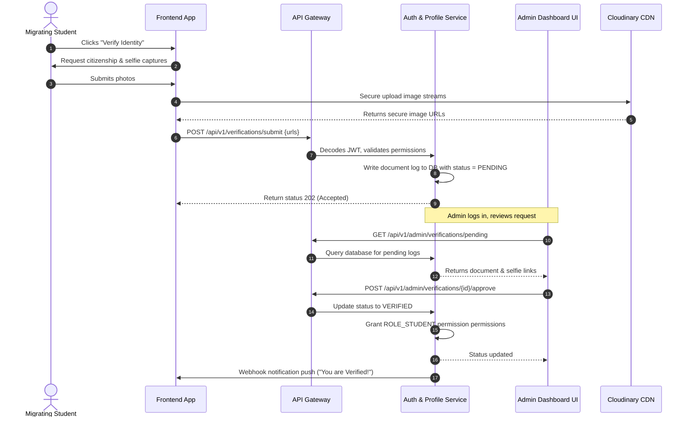
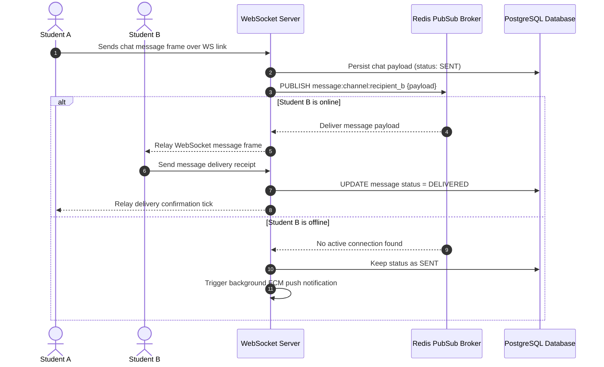

# UniSphere Nepal: System Design Document
**Document Version:** 1.0.0  
**Target:** Senior Engineering Execution & Technical Due Diligence Vetting  

---

## 1. Scale Estimations & Calculations

To design an architecture that is cost-effective yet highly performant, we establish numerical load assumptions based on the higher-education student migration statistics in Nepal.

### 1.1 User & Traffic Estimations
* **Total Enrolled/Migrating Users (TAM):** 100,000 active students per year.
* **Monthly Active Users (MAU):** 60,000 (concentrated around admissions periods: July-September and January-February).
* **Daily Active Users (DAU):** 15,000 (assuming a 25% DAU/MAU ratio).
* **Average Session Duration:** 12 minutes per day.
* **Peak Traffic Ratio:** 4x of average traffic (during exam result release or college admission weeks).

### 1.2 Query Per Second (QPS) Calculations
* **Total requests per user session:** 40 HTTP requests (browsing feeds, clicking rooms, chatting, quiz updates).
* **Daily Web/API Transactions:** 

$$15,000 \text{ DAU} \times 40 \text{ requests} = 600,000 \text{ requests/day}$$

* **Average QPS:** 

$$\frac{600,000 \text{ requests}}{86,400 \text{ seconds}} \approx 7.0 \text{ requests/second (RPS)}$$

* **Peak QPS:** 

$$7.0 \text{ RPS} \times 4 = \mathbf{28.0 \text{ RPS}}$$

* **Chat Message QPS:** 
  * Active chatters per day: 5,000 students.
  * Average messages per user: 15 messages/day.
  * Total chat messages/day: 75,000 messages.
  * Chat QPS: $\approx 0.86$ messages/second. Peak Chat QPS: **3.5 messages/second**.

### 1.3 Storage & Bandwidth Projections
* **Listing Images (Cloudinary/GCS):**
  * 5,000 new room listings posted per year.
  * 4 high-resolution images per listing $\approx$ 20,000 images/year.
  * Average image size: 1.5 MB.
  * Yearly Image Storage: 

$$20,000 \times 1.5 \text{ MB} = 30,000 \text{ MB} = \mathbf{30 \text{ GB/year}}$$

* **Verification Documents (Highly Secure Cold Storage):**
  * 50,000 registered students upload 1 verification ID (1 MB) + 1 selfie (1.5 MB) = 2.5 MB/user.
  * Total Verification Storage: 

$$50,000 \times 2.5 \text{ MB} = 125,000 \text{ MB} = \mathbf{125 \text{ GB total}}$$

* **Database (PostgreSQL) Storage:**
  * Average row size in `users` + `student_profiles` + `roommate_preferences`: 2 KB.
  * For 100,000 users: 200 MB.
  * Average row size in `chat_messages`: 250 bytes.
  * 5,000,000 messages stored: 1.25 GB.
  * Metadata, logs, and listings: 1.5 GB.
  * Total DB Size: **~3 GB for first 2 years** (easily fits in memory-cached relational setups).

---

## 2. System Architecture Topology

We use a **Modular Monolith** structure wrapping distinct domain contexts. The architecture is ready to break into containerized microservices if needed.

```
                                +---------------------------+
                                |    Client Application     |
                                | (React Web / React Native)|
                                +-------------+-------------+
                                              | HTTPS / WSS
                                              v
                                +---------------------------+
                                |    Cloudflare Edge CDN    |
                                |  (WAF, DDoS Protection,   |
                                |     SSL/TLS Termination)  |
                                +-------------+-------------+
                                              | Reverse Proxy
                                              v
                                +---------------------------+
                                |    Spring Cloud Gateway   |
                                | (Auth Verification Filter,|
                                |   Redis Rate Limiter)     |
                                +-------------+-------------+
                                              |
                                              +--------------------------------------+
                                              | Route matching                       |
                                              v                                      v
                             +----------------------------------+     +------------------------------+
                             |   UniSphere Application Engine   |     |    Node.js WebSocket Server  |
                             |   (Spring Boot Bootstrapped)     |     |   (Real-time Chat Handling)  |
                             +----------------+-----------------+     +--------------+---------------+
                                              |                                      |
       +------------------+-------------------+------------------+                   | Chat Events
       |                  |                   |                  |                   v
       v REST             v PostgreSQL        v Cache/PubSub     v File Uploads   +------------------+
+--------------+   +--------------+    +--------------+   +--------------+        |  Redis Pub/Sub   |
| Third-Party  |   | PostgreSQL DB|    | Redis Cache  |   | Cloudinary   |        |  Message Broker  |
| SMS Gateways |   |   (Master)   |    |    Store     |   | Media CDN    |        +------------------+
+--------------+   +-------+------+    +--------------+   +--------------+
                           |
                           v Replication
                   +-------+------+
                   | PostgreSQL DB|
                   | (Read Replica|
                   +--------------+
```

---

## 3. Database & Storage Architecture

### 3.1 Spatial Query Indexing (PostGIS)
Finding rooms within a specific distance from a university (e.g., within 1 km of IOE Pulchowk Gate) is a critical requirement. We use **PostGIS spatial columns** instead of using slow bounding-box calculations:

```sql
-- Convert latitude and longitude to geography points for spatial indexing
ALTER TABLE listings ADD COLUMN geom GEOGRAPHY(Point, 4326);

-- Create a spatial index to optimize search operations
CREATE INDEX idx_listings_geom ON listings USING GIST (geom);

-- Trigger to keep geography column updated on row insertion/updates
CREATE OR REPLACE FUNCTION update_listings_geom()
RETURNS TRIGGER AS $$
BEGIN
    NEW.geom = ST_SetSRID(ST_MakePoint(NEW.location_lng, NEW.location_lat), 4326)::geography;
    RETURN NEW;
END;
$$ LANGUAGE plpgsql;

CREATE TRIGGER trg_update_listings_geom
BEFORE INSERT OR UPDATE ON listings
FOR EACH ROW EXECUTE FUNCTION update_listings_geom();
```

* **Query Example:** Finding rooms within 1.5 km of Pulchowk Campus (latitude: `27.6813`, longitude: `85.3182`):
```sql
SELECT id, title, rent_amount, ST_Distance(geom, ST_MakePoint(85.3182, 27.6813)::geography) AS distance_meters
FROM listings
WHERE ST_DWithin(geom, ST_MakePoint(85.3182, 27.6813)::geography, 1500) AND is_available = TRUE
ORDER BY distance_meters ASC;
```

### 3.2 Replication & High Availability (HA)
* **Master-Replica Configuration:** Single primary PostgreSQL instance handles all state mutations (writes). Read requests (searching rooms, viewing feeds) are routed to a **Read Replica** to reduce master node load.
* **Auto-Failover:** Configured using cloud-native managed databases (AWS RDS or GCP Cloud SQL) to auto-promote the read replica if the master experiences hardware failure.
* **Backup Policies:** Daily automated snapshots with point-in-time recovery (PITR) up to 7 days, backed up in a geo-redundant object storage bucket.

---

## 4. Component-Level Functional Designs

### 4.1 Authentication & Registration Service
* **Identity Provider:** Spring Security using stateless JWT.
* **Verification Pipeline:**
  1. User initiates signup with phone number.
  2. Verification service inserts a temporary verification key in Redis: `SET EX user:otp:9841234567 123456 EX 300` (5 minutes lifespan).
  3. SMS API relays the OTP code.
  4. Upon OTP validation, registration persists, and tokens issue.

### 4.2 Spatial Housing Directory
* **Query Caching:** Popular localities (e.g., "Koteshwor", "Pulchowk", "Bagbazar") have their spatial listing arrays cached in Redis.
* **Cache Invalidation:** Updates or creations in listings trigger eviction of cached geo-queries in the neighborhood range:
```
Evict keys matching pattern: listings:geo:27.68*:85.31*
```

### 4.3 Roommate Matching Engine Architecture
The Gower similarity algorithm requires processing matrix-style logic. To avoid CPU throttling during active database queries, matching is decoupled:

```
+-----------------------------------+
|     User Updates Quiz Answers     |
+-----------------+-----------------+
                  | Writes to DB
                  v
+-----------------+-----------------+
| Roommate Quiz Table Event Trigger |
+-----------------+-----------------+
                  | Push Event
                  v
+-----------------+-----------------+
|       RabbitMQ / Redis PubSub     |
+-----------------+-----------------+
                  | Consumer Trigger
                  v
+-----------------+-----------------+
|  Asynchronous Matching Worker     |
|   1. Pull local candidate vectors |
|   2. Compute similarity matrix    |
|   3. Store top 50 matches in Redis|
+-----------------+-----------------+
                  | Cache Results
                  v
+-----------------+-----------------+
| Redis Sorted Set: matches:user_id |
+-----------------------------------+
```

### 4.4 Real-time Chat & WS Scaling
* **Server Stack:** Dedicated Node.js server using Socket.io or Java Netty to manage persistent state connections.
* **Redis PubSub Message Broker:** If User A is connected to WS Server 1, and User B is connected to WS Server 2, Server 1 publishes the chat payload to Redis Pub/Sub:
  `PUBLISH chat:channel:user_b_id '{"message": "Hello"}'`
  Server 2 consumes the message and relays it via User B's active WebSocket connection.
* **Message Delivery Vetting:** Unacknowledged WebSocket dispatches trigger an automated push notification request via Google's Firebase Cloud Messaging (FCM) after a 10-second timeout.

---

## 5. Sequence Flows

### 5.1 Student Verification Sequence


### 5.2 Real-time Message Lifecycle


---

## 6. Caching Topology & Policy

Redis acts as our caching and transient memory layer to maximize request-response speeds.

| Data Type | Cache Key Structure | Cache Pattern | Eviction Policy | TTL Lifespan |
| :--- | :--- | :--- | :--- | :--- |
| **Authentication OTP** | `auth:otp:{phone}` | Write-through | `volatile-lru` | 5 Minutes (300s) |
| **User Access Claims** | `auth:claims:{user_id}`| Cache-aside | `allkeys-lru` | 1 Hour (3600s) |
| **Listing Summaries** | `listing:detail:{list_id}`| Cache-aside | `allkeys-lru` | 24 Hours (86400s)|
| **Ranked Match IDs** | `matches:ranked:{user_id}`| Write-behind | `allkeys-lru` | 12 Hours (43200s)|
| **API Rate Limits** | `rate:limit:{ip_address}`| Read-update | `volatile-lru` | 1 Minute (60s) |

---

## 7. Security, WAF, & Threat Mitigation

### 7.1 Web Application Firewall (WAF) Configurations (Cloudflare Edge)
* **DDoS Vetting:** Automated rate-limiting triggers managed JS challenges (Cloudflare Turnstile) if an IP requests `/api/v1/auth/signup` more than 15 times in 10 minutes.
* **SQL Injection & XSS Shield:** Strict Rule Expressions scanning URI arguments and request payloads for common attack signatures (e.g., `UNION SELECT`, `<script>` injections).
* **Geofence Blocking:** REST API endpoints are restricted to networks within South Asia (Nepal, India) during Phase 1 to block remote botnet traffic.

### 7.2 Secure API Gateway Vetting
* **Token Integrity:** Spring Security Gateway performs token checksum validations prior to routing traffic to internal modules. 
* **SSL/TLS Protocol:** Strict enforcement of TLS 1.3 protocol. No connections allowed over TLS 1.0/1.1 or unencrypted HTTP.
* **Sensitive File Anonymization:** Verification selfies and identity card pictures are served via Cloudinary **signed URLs**. The URLs expire after 10 minutes, protecting student documents from public indexing.
