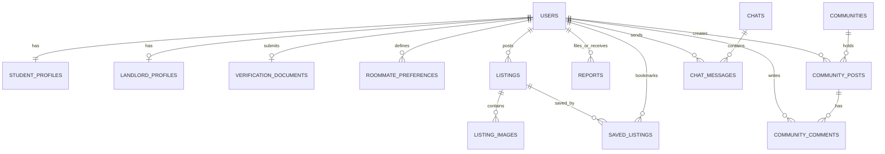

# UniSphere Nepal: Venture-Capital-Ready Blueprint (Expanded Edition)
**Document Version:** 1.1.0  
**Author:** Founding Team / Antigravity AI  
**Target:** Seed/Pre-Seed Venture Capital Funding & Engineering Execution  

---

## Table of Contents
1. [Task 1: Startup Consultant Analysis](#task-1-startup-consultant-analysis)
2. [Task 2: Product Requirement Document (PRD)](#task-2-product-requirement-document-prd)
3. [Task 3: UI/UX Designer Screen Specification](#task-3-uiux-designer-screen-specification)
4. [Task 4: System & Database Architecture](#task-4-system--database-architecture)
5. [Task 5: Backend Architecture & API Design](#task-5-backend-architecture--api-design)
6. [Task 6: Frontend Architecture & Design](#task-6-frontend-architecture--api-design)
7. [Task 7: Roommate Matching Engine Design](#task-7-roommate-matching-engine-design)
8. [Task 8: Anti-Scam & Trust Systems](#task-8-anti-scam--trust-systems)
9. [Task 9: Deployment & Infrastructure Architecture](#task-9-deployment--infrastructure-architecture)
10. [Task 10: Product Roadmap & Timelines](#task-10-product-roadmap--timelines)
11. [Task 11: Monetization & Business Model (Deep-Dive)](#task-11-monetization--business-model-deep-dive)
12. [Task 12: Database DDL Schema (PostgreSQL DDL)](#task-12-database-ddl-schema-postgresql-ddl)
13. [Task 13: REST API JSON Payloads (Interface Specifications)](#task-13-rest-api-json-payloads-interface-specifications)
14. [Task 14: Step-by-Step Mathematical Matching Example](#task-14-step-by-step-mathematical-matching-example)
15. [Task 15: Regulatory, Legal, and Payment Compliance in Nepal](#task-15-regulatory-legal-and-payment-compliance-in-nepal)

---

## Task 1: Startup Consultant Analysis

### 1. Market Opportunity
Nepal is experiencing an unprecedented wave of youth migration from districts and villages to major urban hubs for higher education (Bachelor’s and Master’s programs). 
* **Key Academic Hubs:** Kathmandu Valley (Kathmandu, Lalitpur, Bhaktapur), Pokhara, Butwal, Nepalgunj, Dharan, and Chitwan.
* **Target Audience Demographics:** Students aged 17–25 enrolling in Tribhuvan University (TU), Kathmandu University (KU), Pokhara University (PokU), Purvanchal University (PU), and foreign-affiliated colleges (British, Indian, and Malaysian boards).
* **Total Addressable Market (TAM):** Over 450,000 active higher-education students in Nepal. Approximately 120,000+ students migrate across districts annually.
* **Serviceable Addressable Market (SAM):** 75,000+ migrating students per year who rely on internet/smartphones for decisions.
* **Serviceable Obtainable Market (SOM):** 25,000+ users in the first 18 months, focusing on the Kathmandu-Pokhara corridor.
* **Financial Value Proposition:** The student rental market in Nepal is highly transactional but cash-based, with typical monthly student rents ranging from NPR 6,000 to NPR 15,000 per room. An average student stays 3–4 years in their college city, making their lifetime value (LTV) on housing decisions extremely high.

### 2. Existing Competitors
1. **Facebook Groups & Marketplace (e.g., "Flatmate Kathmandu", "Room Finder"):**
   * *Strengths:* Massive reach, free to use, highly familiar.
   * *Weaknesses:* High noise-to-signal ratio, flooded with unauthorized brokers, rampant scams (advance payment fraud), no roommate compatibility matching, terrible search/filtering, and zero safety vetting.
2. **Traditional Local Brokers ("Dalals"):**
   * *Strengths:* Physical access to unlisted rooms, strong offline networks.
   * *Weaknesses:* High commission fees (often 50% to 100% of the first month's rent), pressure-selling tactics, lack of transparency, and unsafe for female students.
3. **Generic Classified Sites (e.g., Hamrobazaar):**
   * *Strengths:* High domain authority, established traffic.
   * *Weaknesses:* Not tailored to students, lack of interactive roommate discovery, lack of trust verification, and cluttered user interface.
4. **Co-living & Hostels (Private operators):**
   * *Strengths:* Managed services, utilities included.
   * *Weaknesses:* Very expensive (NPR 12,000 - 20,000+ per month), low privacy, limited capacity, and restricted to high-income demographics.

### 3. SWOT Analysis
```
+----------------------------------------------------+----------------------------------------------------+
| STRENGTHS                                          | WEAKNESSES                                         |
| - Specialized student-first focus.                 | - Cold-start problem (liquidity of listings).      |
| - Mathematically driven roommate matching.         | - High retention churn after matching occurs.      |
| - Rigid multi-factor student verification.         | - Dependence on landlords learning the platform.   |
| - Native community integration building sticky LTV.| - Limited online map accuracy in deep sub-localities.|
+----------------------------------------------------+----------------------------------------------------+
| OPPORTUNITIES                                      | THREATS                                            |
| - Partnerships with top-tier colleges.             | - Established classifieds adding student tabs.     |
| - Marketplace expansion (student furniture/books). | - Regulatory changes regarding tenant verification.  |
| - Digital payment integration for escrow/deposits.  | - Scammers adapting to verification processes.     |
| - Expanding to student career, internship placement.| - Instability in internet/SMS carrier services.     |
+----------------------------------------------------+----------------------------------------------------+
```

### 4. Growth & Go-to-Market (GTM) Strategy
* **The "Bridge Course" Hook:** Partner with bridge course institutes (e.g., PEA, NAME, Prasanna, Climax) where high school graduates study before college entrance exams. Run physical workshops and distribute "UniSphere Welcome Packs."
* **Campus Ambassador Network:** Hire 2–3 influential senior students in major colleges (e.g., St. Xavier's, IOE Pulchowk, KUSOM, Islington, Apex, Softwarica) as paid/incentivized ambassadors. They act as local community admins and listing scouts.
* **College Admissions Integration:** Secure partnerships with private college administration desks. When a student from outside the city gets admission, the college includes a UniSphere Welcome Pack onboarding link in their welcome letter.
* **SEO Local Dominance:** Develop landing pages optimized for search terms like *"rooms for rent near IOE Pulchowk"*, *"girls hostel alternative in Tinkune"*, or *"roommates in Pokhara."*

---

## Task 2: Product Requirement Document (PRD)

### 1. Document Overview & Goals
The UniSphere Nepal platform MVP (Phase 1) is designed to solve the critical "trust and discovery deficit" for students relocating to academic centers in Nepal. The primary goals are:
* Reduce the average search time for student housing from 14 days to under 48 hours.
* Eliminate financial fraud (fake room deposits) through double-sided verification.
* Facilitate high-compatibility roommate pairings to decrease mid-semester room lease break rates.

### 2. User Personas
#### Persona A: The Vulnerable Mover (Aayush Adhikari)
* **Demographics:** 18 years old, male, from Biratnagar, moving to Kathmandu for CSIT at Apex College.
* **Needs:** Safe, budget-friendly room (budget: < NPR 7,000/month), near college or direct public bus route, and a roommate to share expenses.
* **Pain Points:** Scared of being scammed by brokers; doesn't know Lalitpur routes; has no friends in the capital.

#### Persona B: The Habit-Conscious Studier (Shristi Shrestha)
* **Demographics:** 21 years old, female, from Pokhara, moving to Lalitpur for Engineering at IOE Pulchowk.
* **Needs:** Extremely quiet room, non-smoker roommate, clean study habits, strict security.
* **Pain Points:** Worried about sharing a room with someone who stays up late partying or doesn't clean the bathroom.

#### Persona C: The Student Landlord (Uncle Ram)
* **Demographics:** 54 years old, owns a 4-story house in Koteshwor, Kathmandu.
* **Needs:** Quiet, well-behaved student tenants who pay rent on time and don't damage property.
* **Pain Points:** Tired of deal-breaker tenants; doesn't know how to post listings on digital platforms; hates paying brokers.

---

### 3. PRD Feature Matrix & Specifications

```
+----+----------------------+----------+----------+---------------------------------------------------------------+
| ID | Feature Name         | Priority | Actor    | Summary                                                       |
+----+----------------------+----------+----------+---------------------------------------------------------------+
| F1 | Student Auth & OTP   | P0       | Student  | Secure JWT signup with phone number, email, and OTP confirmation. |
| F2 | Verification Engine  | P0       | Student  | Document upload (College ID/Citizenship) and admin dashboard.  |
| F3 | Housing Listings     | P0       | Land/Stud| Create, search, filter, and view student rooms.               |
| F4 | Compatibility Match  | P0       | Student  | 9-factor questionnaire with matching percentage results.      |
| F5 | Communities          | P1       | Student  | Regional/interest-based hubs for student networking.           |
| F6 | Direct Messaging     | P0       | Student  | Real-time locked chat between verified users with masking.    |
| F7 | Report & Moderate    | P1       | All      | Flagging system for spam, scams, and abusive behavior.         |
+----+----------------------+----------+----------+---------------------------------------------------------------+
```

#### Feature F1: Student Authentication
* **Why it exists:** To prevent anonymous bots, spammers, and malicious users from exploiting the platform.
* **How it works:** Sign-up via mobile number (OTP via SMS) or email. Session maintained using secure JWT (AccessToken + RefreshToken).
* **User Flow:** User enters phone -> receives 6-digit OTP -> enters OTP -> verified -> redirects to Profile Setup.
* **Edge Cases:** 
  * *No SMS delivery:* Fallback to automated voice call OTP or email-based OTP link.
  * *Recycled phone numbers:* If a new student signs up with an old number that has an existing account, trigger an account reclamation process requiring citizenship/academic document check.

#### Feature F2: Student Verification
* **Why it exists:** To build a high-trust network and eliminate fake listings/scammers posing as students.
* **How it works:** Users must upload a photo of their college admission letter, college ID, or national citizenship card, along with a live selfie. Admin approves/rejects via the admin dashboard.
* **User Flow:** User registers -> sees "Unverified" banner -> clicks "Verify" -> uploads College ID & Selfie -> submits -> Status changes to "Pending" -> Admin approves -> Status changes to "Verified" (Green Tick icon appears).
* **Edge Cases:**
  * *In-between admission:* Student is admitted but has not received their college ID. The system must accept the official admission receipt or fee payment voucher.
  * *Selfie-document mismatch:* Admin rejects document, prompting user with specific feedback (e.g., "Blurry photo," "Name does not match registration").

#### Feature F3: Housing Listings
* **Why it exists:** The central component for matching students to physical properties.
* **How it works:** Verified landlords or students seeking replacements upload room listings with details: rent, location coordinates, amenities, photos, distance to landmarks, and lease rules.
* **User Flow (Landlord):** Click "Post Room" -> upload photos -> enter details -> pin location on map -> submit.
* **User Flow (Student):** Open Home Feed -> Filter by budget/location/gender -> Click room card -> View detail -> Click "Message landlord/poster".
* **Edge Cases:**
  * *Ghost listings:* Landlord forgets to mark the room as rented. Platform implements an automated weekly SMS/push notification check: "Is your room still available?" If no response in 48 hours, listing is auto-archived.

#### Feature F4: Roommate Matching
* **Why it exists:** Reduces roommate conflicts and helps students split costs with compatible peers.
* **How it works:** Students answer a 9-factor questionnaire. The matching engine computes a compatibility matrix and displays potential roommates.
* **User Flow:** Fill matching quiz -> View matches with score % -> Click profile to view answers -> Send roommate request.
* **Edge Cases:**
  * *Opposite-gender matching constraints:* Set default preference filters based on conservative cultural contexts in Nepal (e.g., defaults to same-sex matching, allowing users to toggle explicitly).

---

## Task 3: UI/UX Designer Screen Specification

### 1. Global Style System
* **Color Palette (Aesthetics: Modern Slate with Himalayan accents)**
  * **Primary (Brand):** Sagarmatha Cyan (`#0D9488` - Teal-600) & Crimson Rhododendron (`#E11D48` - Rose-600) for interactive elements.
  * **Secondary:** Deep Slate (`#1E293B` - Slate-800) for typography and solid dark sections.
  * **Backgrounds:** Clean off-white (`#F8FAFC`) for light mode; rich obsidian (`#0F172A`) for dark mode.
  * **System Status:** Success Green (`#10B981`), Warning Yellow (`#F59E0B`), Alert Red (`#EF4444`).
* **Typography:**
  * **Primary Font:** *Outfit* (for headers, highly modern and readable).
  * **Body Font:** *Inter* (for UI and text blocks to reduce cognitive strain).
* **UX Principles:**
  * **One-Handed Navigation:** Bottom navigation bar for mobile layout.
  * **Micro-Interactions:** Hover scales on room cards, loading skeleton screens, pull-to-refresh feeds.
  * **Mobile-First Responsive Layout:** Designing strictly for mobile viewport sizes first, then scaling grids to multi-column desktop dashboards.

---

### 2. Screen-by-Screen Blueprint

#### 1. Landing Page
* **Purpose:** Convert incoming student traffic and explain the value proposition.
* **Layout:** Bold hero header, quick search bar (location/college), feature showcase cards, interactive roommate matching demo widget, social proof testimonials, and footer.
* **Components:** Primary CTA Button, Search Input with Autocomplete, Multi-tab city switcher.
* **Mobile/Desktop Design:** Stacked hero elements on mobile; 2-column split (Hero Text | Illustration/Search Map) on desktop.

#### 2. Login Page
* **Purpose:** User authentication.
* **Layout:** Clean, centered card. Minimal inputs. Brand logo at the top.
* **Components:** Phone/Email input field, Password field, "Remember Me" toggle, "Forgot Password" link, social OAuth buttons, "Register here" redirect link.
* **Mobile/Desktop Design:** Full-screen form on mobile; centered card container with left-hand side product illustration on desktop.

#### 3. Register Page
* **Purpose:** Create user accounts.
* **Layout:** Split-step wizard: Account details first, validation next.
* **Components:** Full name field, email field, phone input, password creation, terms & conditions checkbox.
* **Mobile/Desktop Design:** Multi-step wizard with a progress bar at the top.

#### 4. Profile Setup Page
* **Purpose:** Gather essential student data.
* **Layout:** Vertical card layout grouped into: Basic Info, College Selection, Roommate Preference Quiz trigger.
* **Components:** Avatar uploader, College dropdown, Gender selection, Short bio text area.

#### 5. Verification Page
* **Purpose:** Submit identity verification documents.
* **Layout:** Dropzone layout highlighting security and privacy.
* **Components:** Dropdown selection for Document Type (Citizenship, Passport, College ID, Admission Letter), File drag-and-drop area, Camera preview for selfie matching.

```
+--------------------------------------------+
|             VERIFICATION SYSTEM            |
+--------------------------------------------+
| [Select Document Type: College ID       v] |
|                                            |
| +----------------------------------------+ |
| |            [ Drag & Drop ]             | |
| |        or Click to upload photo        | |
| +----------------------------------------+ |
|                                            |
| [Take Live Selfie Button]                  |
|                                            |
| > [!] Documents are securely processed.    |
|                                            |
|              [SUBMIT FOR APPROVAL]         |
+--------------------------------------------+
```

#### 6. Home Feed Screen
* **Purpose:** Central navigation hub for verified users.
* **Layout:** Top search/filter bar, Horizontal carousel for "Recommended Roommates", Vertical grid for "Featured Rooms Near You", Bottom Navigation Bar.
* **Components:** Search bar with filter chips (Price, Verified, Gender-friendly), Navigation icons.

#### 7. Room Search Page
* **Purpose:** Advanced directory search.
* **Layout:** Split-pane layout. 
* **Mobile:** List layout with "Show Map" floating action button. 
* **Desktop:** Left-hand list cards; right-hand interactive OpenStreetMap layer showing pinned room coordinates.
* **Components:** Filter side sheet, Range slider for budget.

#### 8. Room Detail Page
* **Purpose:** View full room information.
* **Layout:** Photo carousel, Quick stats bar (Rent, Deposit, Distance to college, Availability status), Description body, Landlord/Poster profile card, CTA "Chat Now" or "Call Landlord".
* **Components:** Carousel indicator, Bookmark/Save toggle, Interactive Map component.

#### 9. Room Listing Create Page
* **Purpose:** Post a room for rent.
* **Layout:** Stepper form: 1) Pictures & Title, 2) Details & Pricing, 3) Location Map, 4) Terms & Submitting.
* **Components:** Multi-image upload manager, Numeric step inputs, Interactive geocoding map pins.

#### 10. Roommate Discovery Page
* **Purpose:** Explore compatible roommates.
* **Layout:** Grid cards displaying prospective roommates, highlighting matching percentages, shared college, and hobbies.
* **Components:** "Match Questionnaire" update button, "Send Compatibility Request" action.

#### 11. Compatibility Results Page
* **Purpose:** Provide a deep breakdown of why two students matched.
* **Layout:** Side-by-side comparison matrix showing answers of User A and User B, color-coded for matches (Green) and mismatches (Red/Yellow).
* **Components:** Score chart, "Start Chat" CTA button.

#### 12. Student Community Hub
* **Purpose:** Directory of forums.
* **Layout:** Categories section (Colleges, Cities, Interests), list of active community sub-forums with post counts, search bar.
* **Components:** "Create New Community" button, join/leave state toggles.

#### 13. Community Detail Page
* **Purpose:** Interactive forum board.
* **Layout:** Forum board showing post lists sorted by New/Hot/Top, pinned posts at the top, create post composer widget.
* **Components:** Like/Upvote arrows, Comment count badges, Share icon.

#### 14. Chat System Page
* **Purpose:** Real-time communication.
* **Layout:** Left pane (Recent chats list with unread badges), right pane (Chat window, header with user avatar and status, message history, input bar).
* **Components:** File attach menu, phone call trigger (if user allows phone number sharing).

#### 15. Notifications Page
* **Purpose:** Real-time updates.
* **Layout:** Simple linear timeline grouped by "Today", "Yesterday", "Older".
* **Components:** Read-all button, filter pills (All, Match Requests, Chat, System alerts).

#### 16. Saved Listings Page
* **Purpose:** Quick access bookmark repository.
* **Layout:** Two-column grid showing saved rooms and roommate profiles.
* **Components:** Unsave quick-button, Share folder button.

#### 17. Reports Page
* **Purpose:** Report scams or violations.
* **Layout:** Form wizard with radio selections for type of issue (Broker Scam, Misleading Photos, Harassment, Inappropriate Behavior) and text input for evidence description + attachment upload.
* **Components:** File attachment button, Submit Report button.

#### 18. Settings Page
* **Purpose:** Account management.
* **Layout:** Grouped setting list (Profile details, Privacy controls, Notification switches, Account Deletion, Language - Nepali/English).
* **Components:** Toggle switches, Select inputs, Danger button for account delete.

#### 19. Admin Dashboard
* **Purpose:** Internal moderation, user vetting, and metrics tracking.
* **Layout:** Left sidebar (Navigation: Dashboard, Users, Document Approvals, Room Moderation, Reports), Main content panel (KPI cards, Action queues).
* **Components:** KPI cards (Total active users, pending verifications, reported listings), Approvals queue with side-by-side Document vs. Selfie examiner, quick Ban/Warn action buttons.

---

## Task 4: System & Database Architecture

### 1. Monolithic vs. Microservices Decision
For the Phase 1 (MVP) and early Phase 2 of UniSphere Nepal, a **Modular Monolith** architecture is selected over a distributed microservice network.
* **Rationale:**
  * Avoids distributed transaction overhead (important when dealing with user signups, listings, and matching tables).
  * Simplifies deployment and reduces cloud hosting costs in early stages.
  * Ensures fast code iteration times.
  * Uses clear logical boundaries (Spring Boot packages: `com.unisphere.auth`, `com.unisphere.listing`, `com.unisphere.matching`, `com.unisphere.community`) to support painless microservice extraction (e.g., moving the Matching Engine to a Python/FastAPI microservice in Phase 4).

### 2. High-Level System Architecture
```
                         +-----------------------------------+
                         |         Web / Mobile Client       |
                         |        (React / Tailwind / TS)    |
                         +-----------------+-----------------+
                                           | HTTPS
                                           v
                         +-----------------+-----------------+
                         |         Nginx / Cloudflare        |
                         |   (SSL, CDN, Edge Caching, WAF)   |
                         +-----------------+-----------------+
                                           | Reverse Proxy
                                           v
                         +-----------------+-----------------+
                         |      Spring Boot API Gateway      |
                         |   (Rate Limiter, Auth Filter)     |
                         +-----------------+-----------------+
                                           | Internal Routing
                                           v
+------------------------------------------+------------------------------------------+
|                        MODULAR MONOLITH APPLICATION ENGINE                          |
|                                                                                     |
|   +--------------------+  +--------------------+  +--------------------+            |
|   |    Auth & User     |  |      Housing       |  |      Roommate      |            |
|   |       Module       |  |   Listings Module  |  |   Matching Engine  |            |
|   +--------------------+  +--------------------+  +--------------------+            |
|   +--------------------+  +--------------------+  +--------------------+            |
|   |    Community &     |  |       Chat &       |  |    Notification    |            |
|   |    Forums Module   |  |   Messaging Module |  |       Module       |            |
|   +--------------------+  +--------------------+  +--------------------+            |
+------------------------------------------+------------------------------------------+
       |                  |                    |                  |
       | PostgreSQL       | Redis (Session,    | WebSockets       | Cloudinary API
       v                  v Cache, Rate-Limit) v                  v
+--------------+   +--------------+     +--------------+   +--------------+
|  Relational  |   | Cache Store /|     | Real-time WS |   | GCS / S3     |
|   Database   |   | Message PubSub|    |   Broker     |   | Media Storage|
+--------------+   +--------------+     +--------------+   +--------------+
```

---

### 3. Database Architecture (ER Diagram & Table Specifications)

#### Mermaid ER Diagram


#### Database Schema Specifications

##### 1. Table: `users`
* **Purpose:** Base authentication credentials.
* **Fields:**
  * `id` (UUID, Primary Key, Default: `uuid_generate_v4()`)
  * `phone_number` (VARCHAR(15), Unique, Not Null)
  * `email` (VARCHAR(100), Unique, Nullable)
  * `password_hash` (VARCHAR(255), Not Null)
  * `role` (VARCHAR(20), Not Null) - Values: `ROLE_STUDENT`, `ROLE_LANDLORD`, `ROLE_ADMIN`
  * `status` (VARCHAR(20), Not Null) - Values: `PENDING_VERIFICATION`, `VERIFIED`, `SUSPENDED`
  * `created_at` (TIMESTAMP WITH TIME ZONE, Not Null)
  * `updated_at` (TIMESTAMP WITH TIME ZONE, Not Null)
* **Indexes:** 
  * `idx_users_phone` ON `phone_number` (B-Tree, Search optimization)
  * `idx_users_email` ON `email` (B-Tree)

##### 2. Table: `student_profiles`
* **Purpose:** Academic profile details for student users.
* **Fields:**
  * `id` (UUID, Primary Key) - Foreign Key references `users(id)` ON DELETE CASCADE
  * `full_name` (VARCHAR(100), Not Null)
  * `gender` (VARCHAR(10), Not Null) - Values: `MALE`, `FEMALE`, `OTHER`
  * `college_id` (UUID, Nullable) - References `colleges(id)`
  * `major_course` (VARCHAR(100), Nullable)
  * `academic_year` (INTEGER, Nullable)
  * `avatar_url` (VARCHAR(255), Nullable)
  * `bio` (TEXT, Nullable)
  * `hometown_district` (VARCHAR(50), Not Null) - Track migrating origin (e.g., Jhapa, Kaski)
  * `current_city` (VARCHAR(50), Nullable) - Target city (e.g., Kathmandu)
* **Indexes:**
  * `idx_student_college` ON `college_id` (B-Tree)
  * `idx_student_gender` ON `gender` (B-Tree)

##### 3. Table: `verification_documents`
* **Purpose:** Holds documents submitted for identity verification.
* **Fields:**
  * `id` (UUID, Primary Key)
  * `user_id` (UUID, Unique, Not Null) - References `users(id)` ON DELETE CASCADE
  * `document_type` (VARCHAR(30), Not Null) - `COLLEGE_ID`, `CITIZENSHIP`, `ADMISSION_LETTER`
  * `document_url` (VARCHAR(255), Not Null)
  * `selfie_url` (VARCHAR(255), Not Null)
  * `submitted_at` (TIMESTAMP, Not Null)
  * `reviewed_by` (UUID, Nullable) - References `users(id)` (Admin user)
  * `review_status` (VARCHAR(20), Not Null) - `PENDING`, `APPROVED`, `REJECTED`
  * `rejection_reason` (VARCHAR(255), Nullable)
* **Indexes:**
  * `idx_verification_status` ON `review_status` (B-Tree)

##### 4. Table: `listings`
* **Purpose:** Housing rooms properties.
* **Fields:**
  * `id` (UUID, Primary Key)
  * `owner_id` (UUID, Not Null) - References `users(id)` ON DELETE CASCADE
  * `title` (VARCHAR(150), Not Null)
  * `description` (TEXT, Not Null)
  * `rent_amount` (NUMERIC(10, 2), Not Null)
  * `deposit_amount` (NUMERIC(10, 2), Not Null)
  * `location_lat` (DOUBLE PRECISION, Not Null)
  * `location_lng` (DOUBLE PRECISION, Not Null)
  * `room_type` (VARCHAR(20), Not Null) - `SINGLE_ROOM`, `SHARED_ROOM`, `FLAT`
  * `gender_preference` (VARCHAR(15), Not Null) - `BOYS_ONLY`, `GIRLS_ONLY`, `ANY`
  * `amenities` (VARCHAR(50)[], Nullable) - Postgres native array (e.g., `['WIFI', 'WATER_24_7', 'PARKING']`)
  * `is_available` (BOOLEAN, Default: TRUE)
  * `is_verified` (BOOLEAN, Default: FALSE)
  * `created_at` (TIMESTAMP, Not Null)
* **Indexes:**
  * `idx_listings_owner` ON `owner_id` (B-Tree)
  * `idx_listings_rent` ON `rent_amount` (B-Tree, sorting)
  * `idx_listings_location` ON (`location_lat`, `location_lng`) (Spatial Indexing)

##### 5. Table: `roommate_preferences`
* **Purpose:** Answers to the 9-factor roommate compatibility quiz.
* **Fields:**
  * `user_id` (UUID, Primary Key) - References `users(id)` ON DELETE CASCADE
  * `smoking` (INTEGER, Range: 0-2) - 0: Non-smoker, 1: Tolerant, 2: Heavy Smoker
  * `drinking` (INTEGER, Range: 0-2) - 0: Non-drinker, 1: Social, 2: Regular
  * `sleep_schedule` (INTEGER, Range: 0-1) - 0: Early Bird (sleeps < 10 PM), 1: Night Owl (sleeps > 12 AM)
  * `cleanliness` (INTEGER, Range: 0-2) - 0: Minimal, 1: Moderate, 2: Cleanliness Freak
  * `budget_min` (NUMERIC(10, 2), Not Null)
  * `budget_max` (NUMERIC(10, 2), Not Null)
  * `study_habits` (INTEGER, Range: 0-1) - 0: Prefers library/outside, 1: Prefers room study
  * `food_preference` (INTEGER, Range: 0-2) - 0: Vegetarian, 1: Non-Vegetarian, 2: Halal/Other
  * `social_level` (INTEGER, Range: 0-2) - 0: Introverted/Private, 1: Balanced, 2: Highly Social/Outgoing
  * `noise_tolerance` (INTEGER, Range: 0-2) - 0: Quiet/Silent, 1: Moderate, 2: High (No issue with music/tv)

---

## Task 5: Backend Architecture & API Design

### 1. Spring Boot Folder Structure (Standard Gradle Layout)
```
src/main/java/com/unisphere
├── UniSphereApplication.java
├── config
│   ├── SecurityConfig.java
│   ├── RedisConfig.java
│   └── CloudinaryConfig.java
├── controller
│   ├── AuthController.java
│   ├── ListingController.java
│   ├── MatchingController.java
│   └── CommunityController.java
├── security
│   ├── JwtTokenProvider.java
│   ├── JwtAuthenticationFilter.java
│   └── UserPrincipal.java
├── service
│   ├── AuthService.java
│   ├── ListingService.java
│   ├── MatchingService.java
│   └── NotificationService.java
├── repository
│   ├── UserRepository.java
│   ├── ListingRepository.java
│   └── MatchingRepository.java
├── model
│   ├── User.java
│   ├── Listing.java
│   └── RoommatePreference.java
├── dto
│   ├── request
│   │   ├── LoginRequest.java
│   │   └── RoommateQuizRequest.java
│   └── response
│       ├── AuthResponse.java
│       └── MatchingResponse.java
├── exception
│   ├── GlobalExceptionHandler.java
│   └── ResourceNotFoundException.java
└── util
    └── MatchingEngineUtil.java
```

---

### 2. REST Endpoints Matrix

```
+--------+---------------------------------------+-------------------+-----------------------------------------+
| Method | Path                                  | Required Role     | Description                             |
+--------+---------------------------------------+-------------------+-----------------------------------------+
| POST   | /api/v1/auth/signup                   | Public            | Registers a user, triggers SMS OTP      |
| POST   | /api/v1/auth/verify-otp               | Public            | Validates OTP, returns JWT tokens       |
| GET    | /api/v1/listings                      | Public            | Fetches and filters housing listings    |
| POST   | /api/v1/listings                      | ROLE_STUDENT / LL | Creates a new room listing              |
| PATCH  | /api/v1/listings/{id}/verify          | ROLE_ADMIN        | Changes status of room to verified      |
| POST   | /api/v1/matching/preferences          | ROLE_STUDENT      | Submits or updates 9-factor preferences |
| GET    | /api/v1/matching/suggestions          | ROLE_STUDENT      | Returns ranked roommate recommendations |
| GET    | /api/v1/chats/rooms                   | ROLE_STUDENT / LL | Returns active message threads          |
| POST   | /api/v1/verifications/submit          | ROLE_STUDENT / LL | Uploads verification materials          |
+--------+---------------------------------------+-------------------+-----------------------------------------+
```

---

### 3. Security Architecture, Auth Flow, and JWT Lifecycle
* **Authentication Flow:**
  1. Client sends phone and password to `/api/v1/auth/login`.
  2. Spring Security `AuthenticationManager` validates credentials against PostgreSQL storage.
  3. On success, `JwtTokenProvider` issues:
     * **AccessToken** (Expires in 15 Minutes, stored in-memory on frontend or short-lived cookie).
     * **RefreshToken** (Expires in 7 Days, stored in a secure `HttpOnly`, `SameSite=Strict`, `Secure` Cookie).
  4. On API requests, the client attaches the AccessToken to the `Authorization: Bearer <token>` header.
* **Token Blacklisting (Logout):**
  * When a user logs out, the backend writes the remaining lifespan of the AccessToken into a Redis Blacklist (`SETEX blacklisted_<token> <time_to_live> true`).
  * On every request, `JwtAuthenticationFilter` checks if the incoming token exists in Redis. If found, returns `401 Unauthorized`.

---

### 4. Distributed Rate Limiting & Validation Strategy
* **Rate Limiting Engine:**
  * Implemented using Spring Cloud Gateway with **Redis-backed Token Bucket algorithm**.
  * **Public Endpoints (e.g., OTP validation, Login):** Maximum 10 requests per minute per IP address.
  * **Authenticated API endpoints:** Maximum 60 requests per minute per authenticated user session.
  * Triggering the limit returns `429 Too Many Requests`.
* **Validation Strategy:**
  * Use **JSR-380 Standard Validation Annotations** (`jakarta.validation.constraints`) in all DTO input structures:
    * `@Pattern(regexp = "^(98|97)\\d{8}$", message = "Invalid Nepalese mobile number prefix")`
    * `@Size(min = 8, max = 100)` for password strings.
    * `@DecimalMin(value = "0.0")` for financial fields.
  * Custom exception handler catches `MethodArgumentNotValidException` to return structured validation messages (JSON format).

---

## Task 6: Frontend Architecture & Design

### 1. React Folder Structure (Feature-Based Architecture)
```
src
├── main.tsx
├── App.tsx
├── index.css
├── assets
│   └── images/
├── components
│   ├── common
│   │   ├── Button.tsx
│   │   ├── Input.tsx
│   │   ├── Navbar.tsx
│   │   └── Card.tsx
│   └── feedback
│       └── Spinner.tsx
├── context
│   └── AuthContext.tsx
├── hooks
│   ├── useAuth.ts
│   └── useDebounce.ts
├── layouts
│   ├── AuthLayout.tsx
│   └── DashboardLayout.tsx
├── pages
│   ├── Landing.tsx
│   ├── HomeFeed.tsx
│   ├── RoomDetails.tsx
│   ├── RoommateMatch.tsx
│   └── Verification.tsx
├── services
│   ├── api.ts (Axios Base Instance)
│   ├── authService.ts
│   └── matchingService.ts
└── types
    └── index.ts
```

### 2. State Management & Routing
* **Global Core State:** Powered by **React Context API** for security authentication status (`user`, `isAuthenticated`, `isVerified`).
* **Server-State Cache Manager:** Powered by **React Query (TanStack Query)**:
  * Manages data lifecycle for API resources (e.g., `/listings`, `/matching/suggestions`).
  * Implements `staleTime: 5 * 60 * 1000` (5 minutes caching) to reduce repeated API requests on navigation.
  * Employs *Optimistic Updates* for UI interactions like "Save listing" bookmarks.
* **Routing Strategy:**
  * **React Router DOM (v6)** using nested routing paths.
  * `<ProtectedRoute>` component intercepts unauthenticated states and redirects to `/login`.
  * `<RoleGuard allowedRoles={['ROLE_STUDENT']}>` prevents Landlords from entering roommate discovery spaces.

---

## Task 7: Roommate Matching Engine Design

### 1. Core Variables & Data Representation
Each student's profile contains an vector $V_i = [s_i, d_i, h_i, c_i, t_i, f_i, l_i, n_i]$ reflecting the 9 variables (where $i$ is the target student profile).

1. **Smoking ($s$):** Discrete $\{0, 1, 2\}$ (0: Strict non-smoker, 1: Tolerant, 2: Active smoker).
2. **Drinking ($d$):** Discrete $\{0, 1, 2\}$ (0: Non-drinker, 1: Social, 2: Regular).
3. **Sleep Schedule ($h$):** Binary $\{0, 1\}$ (0: Early bird, 1: Night owl).
4. **Cleanliness ($c$):** Discrete $\{0, 1, 2\}$ (0: Low, 1: Moderate, 2: High tidy).
5. **Study Habits ($t$):** Binary $\{0, 1\}$ (0: Outside room, 1: Inside room).
6. **Food Preference ($f$):** Discrete $\{0, 1, 2\}$ (0: Vegetarian, 1: Non-Veg, 2: No preference).
7. **Social Level ($l$):** Discrete $\{0, 1, 2\}$ (0: Introvert, 1: Ambivert, 2: Extrovert).
8. **Noise Tolerance ($n$):** Discrete $\{0, 1, 2\}$ (0: Zero noise, 1: Moderate, 2: High tolerance).
9. **Budget ($b$):** Range $[b_{\min}, b_{\max}]$.

---

### 2. Matching Algorithm & Scoring Model (Gower's Similarity Adaptation)
To match mixed categorical, ordinal, and range values, we deploy a weighted **Gower's Similarity Coefficient** model.
The compatibility score $S(A, B)$ between Student $A$ and Student $B$ is:

$$S(A, B) = \frac{\sum_{k=1}^{N} W_k \cdot s_k(A, B)}{\sum_{k=1}^{N} W_k}$$

Where:
* $W_k$ represents the user-selected weight of importance for variable $k$ (Values: $1$ = Nice to have, $2$ = Important, $3$ = Deal-breaker).
* $s_k(A, B)$ is the similarity metric for variable $k$ calculated below.

#### Metric Definitions for $s_k(A, B)$
* **Smoking & Drinking (Hard Constraints):**
  If $A$ is a strict non-smoker ($s_A = 0$) and $B$ is a smoker ($s_B = 2$), $s_{\text{smoking}}(A, B) = 0$. Otherwise, similarity is $1 - \frac{|s_A - s_B|}{2}$.
* **Sleep Schedule ($h$):**
  Binary match: If $h_A == h_B \implies 1$, else $0$.
* **Cleanliness ($c$):**
  $s_{\text{cleanliness}}(A, B) = 1 - \frac{|c_A - c_B|}{2}$.
* **Budget Compatibility ($s_{\text{budget}}$):**
  Matches if budget ranges overlap. Let $Overlap = \min(b_{\max}^A, b_{\max}^B) - \max(b_{\min}^A, b_{\min}^B)$.
  If $Overlap > 0 \implies 1$, else $1 - \frac{|Mean(A) - Mean(B)|}{MaxRange}$.

---

### 3. Recommendation & Ranking Pipeline
```
               +-------------------------------------------+
               |        Select Active Student Vector       |
               +---------------------+---------------------+
                                     |
                                     v
               +---------------------+---------------------+
               |              Stage 1 Filter               |
               |  - Same City Check                        |
               |  - Same Gender Check                      |
               |  - Dealbreaker Mismatches (Score = 0)     |
               +---------------------+---------------------+
                                     | Candidate Subset
                                     v
               +---------------------+---------------------+
               |              Stage 2 Score                |
               | Calculate Gower's Similarity Coefficient |
               +---------------------+---------------------+
                                     | Unranked Profiles with Scores
                                     v
               +---------------------+---------------------+
               |              Stage 3 Sort                 |
               | Sort by Similarity Score descending       |
               +---------------------+---------------------+
                                     | Ranked Candidate Stream
                                     v
               +---------------------+---------------------+
               |            Stage 4 Cold Start             |
               |  If list < 5 profiles, blend in recent   |
               |  signups from same college                |
               +-------------------------------------------+
```

---

## Task 8: Anti-Scam & Trust Systems

### 1. Verification Funnel
1. **SMS OTP Gateway:** Integrated with localized gateways (Aakash SMS / Sparrow SMS) targeting Nepalese carriers (Ncell, NTC, Smart Cell). Blocks registration via international VoIP numbers.
2. **Double Document Match:** Users upload citizenship/passport (identifies real-world entity) and college documents (identifies academic intent).
3. **Face Matching System:** Integration of a micro-service API using OpenCV/MTCNN models. Compares the user's uploaded selfie with the face photo on their citizenship/college ID cards, generating a likeness confidence rating. Confidences $< 85\%$ are flagged for manual admin check.

---

### 2. Fraud & Spam Detection
* **Geofenced Coordinates Verification:** Landlord room pins must fall within a 500-meter radius of the cellular IP geolocation of the upload device, preventing off-shore/virtual scammers posting fake rooms.
* **Pricing Outlier Alerts:** Listings with rent values lower than 50% of the historical average for that specific neighborhood (e.g., a room for NPR 2,000 in Baneshwor) are auto-suspended and flagged: `POTENTIAL_DEPOSIT_SCAM`.
* **Phone Number Masking:** Direct communication begins strictly on the secure in-app text engine. Contact numbers are masked until both parties exchange at least 5 messages and click "Agree to share contact details."

---

### 3. Trust Score Engine
Every user profile exhibits a **Trust Score (0–100%)** calculated by:

$$\text{Trust Score} = S_{\text{verification}} + S_{\text{reviews}} - S_{\text{reports}}$$

Where:
* $S_{\text{verification}}$: 50% (Base for passing student/landlord verification documents).
* $S_{\text{reviews}}$: Up to 50% (Calculated from post-stay tenant reviews or roommate feedback rating average $\times 10$).
* $S_{\text{reports}}$: Penalty points (-30% for every validated report of harassment, room unavailability, or broker behavior). Users dropping below 30% are automatically suspended.

---

## Task 9: Deployment & Infrastructure Architecture

### 1. Environments Strategy
* **Development (Dev):** local `docker-compose` orchestrating PostgreSQL, Redis, backend container, and frontend build.
* **Staging:** A single cost-effective GCP Compute Instance or AWS EC2 running Docker. Replicates prod configs with scaled-down resources. Used for QA automation verification.
* **Production:** Orchestrated on **Google Kubernetes Engine (GKE)** or AWS EKS with autoscaling active. Uses GCP Cloud SQL for PostgreSQL (highly backed-up, multi-AZ) and managed Memorystore for Redis.

---

### 2. Docker Architecture

#### Backend: Spring Boot Production Dockerfile
```dockerfile
# Stage 1: Build the JAR file
FROM eclipse-temurin:17-jdk-alpine AS builder
WORKDIR /workspace/app
COPY gradle gradle
COPY build.gradle settings.gradle gradlew ./
COPY src src
RUN ./gradlew bootJar --no-daemon

# Stage 2: Minimal runtime image
FROM eclipse-temurin:17-jre-alpine
RUN addgroup -S appgroup && adduser -S appuser -G appgroup
USER appuser
WORKDIR /app
COPY --from=builder /workspace/app/build/libs/*.jar app.jar
EXPOSE 8080
ENTRYPOINT ["java", "-jar", "-Dspring.profiles.active=prod", "app.jar"]
```

#### Frontend: React Production Dockerfile
```dockerfile
# Stage 1: Build static assets
FROM node:18-alpine AS builder
WORKDIR /app
COPY package*.json ./
RUN npm ci
COPY . .
RUN npm run build

# Stage 2: Serve using Nginx
FROM nginx:1.25-alpine
COPY --from=builder /app/dist /usr/share/nginx/html
COPY nginx.conf /etc/nginx/conf.d/default.conf
EXPOSE 80
CMD ["nginx", "-g", "daemon off;"]
```

---

### 3. CI/CD Deployment Pipeline (GitHub Actions Workflow)
```
[ Code Commit / Pull Request to 'main' ]
                  |
                  v
       +----------+----------+
       |   Run Lint & Tests  | (Lints code, runs JUnit & Vitest)
       +----------+----------+
                  | If Passed
                  v
       +----------+----------+
       | Build Docker Images | (Triggers Multi-stage Docker Builds)
       +----------+----------+
                  | If Successful
                  v
       +----------+----------+
       |   Push to Registry  | (Pushes to AWS ECR or Google Artifact Registry)
       +----------+----------+
                  | Authenticated Push
                  v
       +----------+----------+
       | Deploy to Kubernetes| (Applies Helm charts, performs Rolling Update)
       +---------------------+
```

---

### 4. Logging & Monitoring Architecture
* **Distributed Logging:** Container standard outputs are collected by **Fluentbit** agents and piped into **Grafana Loki** for central log querying and search indexing.
* **Metrics Monitoring:** The Spring Boot application exposes runtime telemetry using `spring-boot-starter-actuator`. **Prometheus** polls this endpoint, rendering system dashboards (CPU, memory, active database connection pools, HTTP response latencies) in **Grafana**.
* **Error Tracking:** Frontend and backend throw runtime stack traces to **Sentry** for real-time alerting on production bugs.

---

## Task 10: Product Roadmap & Timelines

```
+------------------------------------------------------------------------------------------+
|                                    UNI-SPHERE ROADMAP                                    |
+---------------------+---------------------+---------------------+------------------------+
| Phase 1: MVP        | Phase 2: Marketplace| Phase 3: Career Hub | Phase 4: AI Matching   |
| [Months 1 - 4]      | [Months 5 - 8]      | [Months 9 - 12]     | [Months 13 - 16]       |
+---------------------+---------------------+---------------------+------------------------+
| - Verification API  | - Roommate Chat     | - Part-time Jobs    | - LLM Chatbot Finder   |
| - SMS OTP Auth      | - Rent Payments     | - Internships Board | - Predictive Pricing   |
| - Core Room Listings| - Book Marketplace  | - CV Builder        | - Optical Image Match  |
+---------------------+---------------------+---------------------+------------------------+
```

### 1. Phase 1: Core MVP (Months 1–4)
* **Goal:** Launch a high-trust room listing and basic roommate compatibility system in Kathmandu Valley.
* **Deliverables:** Verified student registration, room creation forms, matching algorithms, in-app messaging, admin document verification portal.

### 2. Phase 2: Marketplace Expansion (Months 5–8)
* **Goal:** Increase user stickiness and drive initial monetization vectors.
* **Deliverables:** Integrated peer-to-peer buy/sell forum for student furniture, electronics, and books; automated rental agreement generator; online payment gateway integration (eSewa, Khalti) for security deposits.

### 3. Phase 3: Career & Student Lifestyle Hub (Months 9–12)
* **Goal:** Retain students who have already found housing.
* **Deliverables:** Student-only internship and part-time job boards matching corporate partners in Kathmandu/Pokhara with college profiles; automated resume builder tool; regional community discount passes.

### 4. Phase 4: Advanced AI Integrations (Months 13–16)
* **Goal:** Leverage data collections to automate operations and matching accuracy.
* **Deliverables:** AI-powered conversational search (Gemini API chatbot: *"Find me a room under 8k near Pulchowk where roommates are vegetarians"*); computer vision duplicate listing detection; automated rental price trend recommendations.

### 5. Phase 5: Nationwide Expansion (Months 17–24)
* **Goal:** Scale operations out of Kathmandu and Pokhara into all tier-2 Nepalese cities.
* **Deliverables:** Localization of application content; recruitment of campus ambassador networks in Butwal, Dharan, Nepalgunj, Chitwan; establishing strategic partnerships with municipal student bureaus.

---

## Task 11: Monetization & Business Model (Deep-Dive)

To convince venture capitalists of UniSphere Nepal's financial viability, the platform utilizes a diversified monetization framework. We transition from a free MVP utility to transactional and value-added income models.

```
       [ FREE MVP CORE UTILITY ]
                  |
                  +---> Landlord Listing Fees (B2C Premium Placements)
                  |
                  +---> Digital Lease Issuance & Escrow Commission (2-5% fee)
                  |
                  +---> Hyperlocal Student Services Referral (ISP, Logistics)
                  |
                  +---> Corporate College SaaS Dashboard (Verification Check)
```

### 1. Landlord Listing Subscriptions (B2C Model)
* **Basic Tier (Free):** Landlords can list up to 1 room at a time. The listing receives standard visibility, is geo-restricted to student feeds within 3 km, and requires weekly check-ins via SMS to remain active.
* **Premium Listing (NPR 1,500/month per room):**
  * Auto-verification check priority.
  * Pinned top-of-feed display for matching student queries.
  * Direct SMS alert notifications pushed to compatible students looking in that locality.
  * Professional photography support by campus ambassadors (value-add).

### 2. Digital Escrow & Lease Commissions (Transaction Model)
Student housing in Nepal commonly relies on cash advances (often 1–3 months' rent deposit) which are frequently subject to disputes or agent pocketing.
* **Escrow Guarantee Service:** UniSphere processes the initial room reservation deposit. The funds are held in escrow via local bank settlement APIs.
* **Fee Structure:** A transaction fee of **2.5%** is charged to the student, and **2.5%** to the landlord (capped at NPR 500 total).
* **Lease Issuance:** An additional fee of **NPR 300** generates a legally validated digital lease agreement document incorporating both parties' verified citizenship details and biometric approvals.

### 3. Strategic Local Integrations (B2B2C Affiliate Model)
Students relocating require services: internet connection, moving transport, and furniture.
* **Internet Providers (ISPs):** Integrated referral system during signup. If a student chooses an ISP package (e.g., WorldLink, Vianet, DishHome) via the dashboard, UniSphere receives a **10% affiliate commission**.
* **Logistics / Moving ("Sahayogi" services):** Partner with local mini-truck and packing companies. Booking through UniSphere splits cargo, lowering student costs while yielding a **15% booking margin**.

### 4. College Verification SaaS (B2B Enterprise Model)
* Colleges spend substantial administrative resources verifying students' off-campus residency logs for safety, accreditation, and logistics.
* UniSphere offers an enterprise subscription dashboard (NPR 15,000/year per college campus) allowing college administration offices to check real-time, anonymized mapping statistics of where their enrolled student body resides, including instant emergency notification relays.

---

## Task 12: Database DDL Schema (PostgreSQL DDL)

Here is the complete production DDL database script containing exact relationships, indexes, constraints, and triggers required to support the UniSphere data architecture.

```sql
-- Enable UUID extension
CREATE EXTENSION IF NOT EXISTS "uuid-ossp";

-- Define Enums
CREATE TYPE user_role AS ENUM ('ROLE_STUDENT', 'ROLE_LANDLORD', 'ROLE_ADMIN');
CREATE TYPE user_status AS ENUM ('PENDING_VERIFICATION', 'VERIFIED', 'SUSPENDED');
CREATE TYPE verification_status AS ENUM ('PENDING', 'APPROVED', 'REJECTED');
CREATE TYPE doc_type AS ENUM ('COLLEGE_ID', 'CITIZENSHIP', 'ADMISSION_LETTER');
CREATE TYPE room_type_enum AS ENUM ('SINGLE_ROOM', 'SHARED_ROOM', 'FLAT');
CREATE TYPE gender_pref_enum AS ENUM ('BOYS_ONLY', 'GIRLS_ONLY', 'ANY');

-- 1. Table: users
CREATE TABLE users (
    id UUID PRIMARY KEY DEFAULT uuid_generate_v4(),
    phone_number VARCHAR(15) UNIQUE NOT NULL,
    email VARCHAR(100) UNIQUE,
    password_hash VARCHAR(255) NOT NULL,
    role user_role NOT NULL DEFAULT 'ROLE_STUDENT',
    status user_status NOT NULL DEFAULT 'PENDING_VERIFICATION',
    created_at TIMESTAMP WITH TIME ZONE DEFAULT CURRENT_TIMESTAMP,
    updated_at TIMESTAMP WITH TIME ZONE DEFAULT CURRENT_TIMESTAMP
);

CREATE INDEX idx_users_phone ON users(phone_number);
CREATE INDEX idx_users_email ON users(email);

-- 2. Table: colleges
CREATE TABLE colleges (
    id UUID PRIMARY KEY DEFAULT uuid_generate_v4(),
    name VARCHAR(150) NOT NULL UNIQUE,
    city VARCHAR(50) NOT NULL,
    address VARCHAR(255) NOT NULL
);

-- 3. Table: student_profiles
CREATE TABLE student_profiles (
    id UUID PRIMARY KEY REFERENCES users(id) ON DELETE CASCADE,
    full_name VARCHAR(100) NOT NULL,
    gender VARCHAR(10) NOT NULL CONSTRAINT chk_gender CHECK (gender IN ('MALE', 'FEMALE', 'OTHER')),
    college_id UUID REFERENCES colleges(id) ON DELETE SET NULL,
    major_course VARCHAR(100),
    academic_year INT CONSTRAINT chk_year CHECK (academic_year BETWEEN 1 AND 5),
    avatar_url VARCHAR(255),
    bio TEXT,
    hometown_district VARCHAR(50) NOT NULL,
    current_city VARCHAR(50) NOT NULL,
    created_at TIMESTAMP WITH TIME ZONE DEFAULT CURRENT_TIMESTAMP,
    updated_at TIMESTAMP WITH TIME ZONE DEFAULT CURRENT_TIMESTAMP
);

CREATE INDEX idx_student_college ON student_profiles(college_id);

-- 4. Table: verification_documents
CREATE TABLE verification_documents (
    id UUID PRIMARY KEY DEFAULT uuid_generate_v4(),
    user_id UUID UNIQUE NOT NULL REFERENCES users(id) ON DELETE CASCADE,
    document_type doc_type NOT NULL,
    document_url VARCHAR(255) NOT NULL,
    selfie_url VARCHAR(255) NOT NULL,
    submitted_at TIMESTAMP WITH TIME ZONE DEFAULT CURRENT_TIMESTAMP,
    reviewed_by UUID REFERENCES users(id),
    review_status verification_status NOT NULL DEFAULT 'PENDING',
    rejection_reason VARCHAR(255),
    reviewed_at TIMESTAMP WITH TIME ZONE
);

CREATE INDEX idx_verification_status ON verification_documents(review_status);

-- 5. Table: listings
CREATE TABLE listings (
    id UUID PRIMARY KEY DEFAULT uuid_generate_v4(),
    owner_id UUID NOT NULL REFERENCES users(id) ON DELETE CASCADE,
    title VARCHAR(150) NOT NULL,
    description TEXT NOT NULL,
    rent_amount NUMERIC(10, 2) NOT NULL CONSTRAINT chk_rent CHECK (rent_amount > 0),
    deposit_amount NUMERIC(10, 2) NOT NULL CONSTRAINT chk_deposit CHECK (deposit_amount >= 0),
    location_lat DOUBLE PRECISION NOT NULL,
    location_lng DOUBLE PRECISION NOT NULL,
    room_type room_type_enum NOT NULL,
    gender_preference gender_pref_enum NOT NULL DEFAULT 'ANY',
    amenities VARCHAR(50)[] DEFAULT '{}',
    is_available BOOLEAN NOT NULL DEFAULT TRUE,
    is_verified BOOLEAN NOT NULL DEFAULT FALSE,
    created_at TIMESTAMP WITH TIME ZONE DEFAULT CURRENT_TIMESTAMP,
    updated_at TIMESTAMP WITH TIME ZONE DEFAULT CURRENT_TIMESTAMP
);

CREATE INDEX idx_listings_owner ON listings(owner_id);
CREATE INDEX idx_listings_rent ON listings(rent_amount);
CREATE INDEX idx_listings_geo ON listings(location_lat, location_lng);

-- 6. Table: listing_images
CREATE TABLE listing_images (
    id UUID PRIMARY KEY DEFAULT uuid_generate_v4(),
    listing_id UUID NOT NULL REFERENCES listings(id) ON DELETE CASCADE,
    image_url VARCHAR(255) NOT NULL,
    is_primary BOOLEAN DEFAULT FALSE,
    created_at TIMESTAMP WITH TIME ZONE DEFAULT CURRENT_TIMESTAMP
);

-- 7. Table: roommate_preferences
CREATE TABLE roommate_preferences (
    user_id UUID PRIMARY KEY REFERENCES users(id) ON DELETE CASCADE,
    smoking INT NOT NULL CONSTRAINT chk_smoke CHECK (smoking BETWEEN 0 AND 2),
    drinking INT NOT NULL CONSTRAINT chk_drink CHECK (drinking BETWEEN 0 AND 2),
    sleep_schedule INT NOT NULL CONSTRAINT chk_sleep CHECK (sleep_schedule BETWEEN 0 AND 1),
    cleanliness INT NOT NULL CONSTRAINT chk_clean CHECK (cleanliness BETWEEN 0 AND 2),
    budget_min NUMERIC(10, 2) NOT NULL,
    budget_max NUMERIC(10, 2) NOT NULL,
    study_habits INT NOT NULL CONSTRAINT chk_study CHECK (study_habits BETWEEN 0 AND 1),
    food_preference INT NOT NULL CONSTRAINT chk_food CHECK (food_preference BETWEEN 0 AND 2),
    social_level INT NOT NULL CONSTRAINT chk_social CHECK (social_level BETWEEN 0 AND 2),
    noise_tolerance INT NOT NULL CONSTRAINT chk_noise CHECK (noise_tolerance BETWEEN 0 AND 2),
    updated_at TIMESTAMP WITH TIME ZONE DEFAULT CURRENT_TIMESTAMP,
    CONSTRAINT chk_budget CHECK (budget_min <= budget_max)
);

-- 8. Trigger to Auto-Update updated_at timestamps
CREATE OR REPLACE FUNCTION update_modified_column()
RETURNS TRIGGER AS $$
BEGIN
    NEW.updated_at = NOW();
    RETURN NEW;
END;
$$ LANGUAGE plpgsql;

CREATE TRIGGER update_users_modtime BEFORE UPDATE ON users FOR EACH ROW EXECUTE FUNCTION update_modified_column();
CREATE TRIGGER update_student_profiles_modtime BEFORE UPDATE ON student_profiles FOR EACH ROW EXECUTE FUNCTION update_modified_column();
CREATE TRIGGER update_listings_modtime BEFORE UPDATE ON listings FOR EACH ROW EXECUTE FUNCTION update_modified_column();
CREATE TRIGGER update_roommate_preferences_modtime BEFORE UPDATE ON roommate_preferences FOR EACH ROW EXECUTE FUNCTION update_modified_column();
```

---

## Task 13: REST API JSON Payloads (Interface Specifications)

Below are the exact API JSON payloads specifying client-server data contracts.

### 1. Student Signup Request (`POST /api/v1/auth/signup`)
```json
{
  "phoneNumber": "9841234567",
  "email": "aayush.adhikari@student.edu.np",
  "password": "SecurePassword123!",
  "role": "ROLE_STUDENT",
  "profile": {
    "fullName": "Aayush Adhikari",
    "gender": "MALE",
    "hometownDistrict": "Biratnagar",
    "currentCity": "Kathmandu",
    "collegeId": "9b1deb4d-3b7d-4bad-9bdd-2b0d7b3dcb6d",
    "majorCourse": "BSc CSIT",
    "academicYear": 1
  }
}
```

### 2. Authentication Response (`POST /api/v1/auth/verify-otp`)
*Note: The HTTP Response contains the `Refresh-Token` stored in a secure cookie header `Set-Cookie`.*
```json
{
  "statusCode": 200,
  "message": "OTP verification successful",
  "data": {
    "accessToken": "eyJhbGciOiJIUzI1NiIsInR5cCI6IkpXVCJ9.eyJzdWIiOiI5YjFkZ...",
    "expiresInMs": 900000,
    "user": {
      "id": "a9a3b680-df78-43d9-9bb5-7c569f10a8d4",
      "phoneNumber": "9841234567",
      "role": "ROLE_STUDENT",
      "status": "PENDING_VERIFICATION",
      "fullName": "Aayush Adhikari"
    }
  }
}
```

### 3. Create Listing Request (`POST /api/v1/listings`)
```json
{
  "title": "Sunlit single room near IOE Pulchowk gate",
  "description": "Looking for a quiet student tenant. The room is fully furnished with a bed, desk, and bookshelf. Share kitchen and bathroom with one other engineering student. 24 hours water supply.",
  "rentAmount": 7500.00,
  "depositAmount": 7500.00,
  "locationLat": 27.681124,
  "locationLng": 85.318854,
  "roomType": "SINGLE_ROOM",
  "genderPreference": "ANY",
  "amenities": ["WIFI", "WATER_24_7", "PARKING", "FURNISHED"],
  "imageUrls": [
    "https://res.cloudinary.com/unisphere/image/upload/v1234/room_main.jpg",
    "https://res.cloudinary.com/unisphere/image/upload/v1234/room_kitchen.jpg"
  ]
}
```

### 4. Roommate Match Response (`GET /api/v1/matching/suggestions`)
```json
{
  "statusCode": 200,
  "data": [
    {
      "studentId": "d0f28e21-0a25-4cd9-bf0c-8d19597371cc",
      "fullName": "Suman Thapa",
      "collegeName": "IOE Pulchowk Campus",
      "gender": "MALE",
      "hometownDistrict": "Kaski",
      "matchScorePercentage": 92.5,
      "matchingPreferences": {
        "smoking": 0,
        "cleanliness": 2,
        "sleepSchedule": 0,
        "budgetOverlap": true
      },
      "mismatchedPreferences": {
        "socialLevel": "User is Introverted; Match is Extroverted"
      }
    }
  ]
}
```

---

## Task 14: Step-by-Step Mathematical Matching Example

To show how the Matching Engine functions in production, let's step through a real scenario mapping **Student A (Aayush)** and **Student B (Suman)**.

### 1. Feature Vector Mapping
* Let $V_k$ represent the quiz variable elements.
* The user inputs weights $W_k \in \{1, 2, 3\}$ (1: Low/Nice-to-have, 2: Moderate/Important, 3: High/Deal-breaker).

| Variable ($k$) | Student A ($A$) | Student B ($B$) | Weight ($W_k$) | Calculation Rule |
| :--- | :---: | :---: | :---: | :--- |
| **1. Smoking ($s$)** | $0$ (Non) | $0$ (Non) | $3$ (Deal-breaker) | Binary/Extreme Distance |
| **2. Cleanliness ($c$)**| $2$ (High) | $1$ (Moderate) | $2$ (Important) | $1 - \frac{\|c_A - c_B\|}{2}$ |
| **3. Sleep ($h$)** | $0$ (Early) | $0$ (Early) | $2$ (Important) | Same = $1$, Diff = $0$ |
| **4. Social ($l$)** | $0$ (Intro) | $2$ (Extro) | $1$ (Nice to have)| $1 - \frac{\|l_A - l_B\|}{2}$ |
| **5. Budget ($b$)** | $[6k, 8k]$ | $[7k, 9k]$ | $3$ (Deal-breaker) | Range Overlap check |

---

### 2. Variable Similarity Calculations ($s_k$)

#### Variable 1: Smoking ($s$)
* $s_A = 0$, $s_B = 0$.
* Both are strict non-smokers.
* $s_1(A, B) = 1.0$ (Complete Match).

#### Variable 2: Cleanliness ($c$)
* $c_A = 2$ (Tidy), $c_B = 1$ (Moderate).
* $s_2(A, B) = 1 - \frac{|2 - 1|}{2} = 1 - 0.5 = 0.5$.

#### Variable 3: Sleep Schedule ($h$)
* $h_A = 0$ (Early Bird), $h_B = 0$ (Early Bird).
* $h_A == h_B \implies s_3(A, B) = 1.0$.

#### Variable 4: Social Level ($l$)
* $l_A = 0$ (Introvert), $l_B = 2$ (Extrovert).
* $s_4(A, B) = 1 - \frac{|0 - 2|}{2} = 1 - 1.0 = 0.0$.

#### Variable 5: Budget ($b$)
* $b_A = [6,000, 8,000]$, $b_B = [7,000, 9,000]$.
* Overlap Interval: $[\max(6000, 7000), \min(8000, 9000)] = [7000, 8000]$.
* Overlap exists (range overlaps by NPR 1,000).
* $s_5(A, B) = 1.0$.

---

### 3. Gower's Similarity Score Aggregation
Using the variables above, we compute the weighted aggregate similarity score:

$$S(A, B) = \frac{\sum_{k=1}^{5} W_k \cdot s_k(A, B)}{\sum_{k=1}^{5} W_k}$$

$$\text{Denominator} = \sum W_k = W_1 + W_2 + W_3 + W_4 + W_5 = 3 + 2 + 2 + 1 + 3 = 11$$

$$\text{Numerator} = (3 \cdot 1.0) + (2 \cdot 0.5) + (2 \cdot 1.0) + (1 \cdot 0.0) + (3 \cdot 1.0)$$

$$\text{Numerator} = 3.0 + 1.0 + 2.0 + 0.0 + 3.0 = 9.0$$

$$S(A, B) = \frac{9.0}{11} \approx 0.8181 \text{ or } \mathbf{81.8\%}$$

Suman Thapa represents an **81.8% compatibility match** for Aayush. In the matching results page, Suman will display with a high-compatibility green match pill, alongside a detailed breakdown highlighting clean smoking alignments but flags potential noise-level differences due to differing social vectors.

---

## Task 15: Regulatory, Legal, and Payment Compliance in Nepal

Operating a transactional student matching platform in Nepal requires alignment with specific local regulatory frameworks.

### 1. Data Privacy & Vetting (Electronic Transactions Act 2063)
* **Encryption Mandates:** Academic IDs and citizenship card photos are classified as sensitive personal identity data. UniSphere implements **AES-256 GCM encryption** at rest for document assets in Cloudinary/GCS, with decryption access restricted via IAM keys.
* **Consent Mechanisms:** Explicit user consent checkboxes during profile setup state: *"I authorize UniSphere Nepal to process my academic document solely for trust verification in accordance with the Privacy Act 2075."*
* **Automatic Deletion Policies:** Once the verification status is determined (approved or rejected), secondary document files are archived off the active web interface onto secure cold storage vaults, with access logs audited monthly.

### 2. Online Payment Gateway Integration
* To handle payments (listing subscriptions, reservations), UniSphere integrates with Nepal's Central Bank (Nepal Rastra Bank - NRB) approved payment providers:
  * **eSewa & Khalti Merchant APIs:** Custom Webhook integrations handle payment validations. Frontend components handle redirection flow, and the backend verifies signatures using HMAC-SHA256 tokens matching transaction identifiers.
  * **Fonepay / IPS Connect (Direct Bank Transfer):** Leverages NRB's Open Banking API structures to support direct bank-to-bank settlement options for reservation security deposits.

### 3. Tenant-Landlord Civil Code (Muluki Dewani Samhita 2074)
According to Chapter 9 of the Muluki Civil Code, agreements for rentals exceeding NPR 20,000 monthly require a formal written lease contract.
* **Automated Compliance Engine:** If a listed room rent exceeds the threshold, the UniSphere database flags a mandatory requirement to generate a standard digital rental agreement form before allowing deposit transfers.
* **E-Signatures:** UniSphere integrates simple digital draw-sign panels verifying identities via SMS OTP authentication, serving as valid written signatures under Nepal's Electronic Transactions Act.
